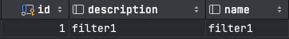

## Примеры json, которые пишет Debezium в Kafka

### Таблица



### Пример key из сообщений в Kafka

```json
{
  "schema": {
    "type": "struct",
    "fields": [
      {
        "type": "int64",
        "optional": false,
        "field": "id"
      }
    ],
    "optional": false,
    "name": "postgres.public.filter.Key"
  },
  "payload": {
    "id": 1
  }
}
```

### Примеры value из сообщений в Kafka

<details>
<summary>При подключении Debezium к Postgres в 1 раз</summary>

```json
{
    "schema": {
      "type": "struct",
      "fields": [
        {
          "type": "struct",
          "fields": [
            {
              "type": "int64",
              "optional": false,
              "field": "id"
            },
            {
              "type": "string",
              "optional": true,
              "field": "description"
            },
            {
              "type": "string",
              "optional": true,
              "field": "name"
            }
          ],
          "optional": true,
          "name": "postgres.public.filter.Value",
          "field": "before"
        },
        {
          "type": "struct",
          "fields": [
            {
              "type": "int64",
              "optional": false,
              "field": "id"
            },
            {
              "type": "string",
              "optional": true,
              "field": "description"
            },
            {
              "type": "string",
              "optional": true,
              "field": "name"
            }
          ],
          "optional": true,
          "name": "postgres.public.filter.Value",
          "field": "after"
        },
        {
          "type": "struct",
          "fields": [
            {
              "type": "string",
              "optional": false,
              "field": "version"
            },
            {
              "type": "string",
              "optional": false,
              "field": "connector"
            },
            {
              "type": "string",
              "optional": false,
              "field": "name"
            },
            {
              "type": "int64",
              "optional": false,
              "field": "ts_ms"
            },
            {
              "type": "string",
              "optional": true,
              "name": "io.debezium.data.Enum",
              "version": 1,
              "parameters": {
                "allowed": "true,last,false"
              },
              "default": "false",
              "field": "snapshot"
            },
            {
              "type": "string",
              "optional": false,
              "field": "db"
            },
            {
              "type": "string",
              "optional": false,
              "field": "schema"
            },
            {
              "type": "string",
              "optional": false,
              "field": "table"
            },
            {
              "type": "int64",
              "optional": true,
              "field": "txId"
            },
            {
              "type": "int64",
              "optional": true,
              "field": "lsn"
            },
            {
              "type": "int64",
              "optional": true,
              "field": "xmin"
            }
          ],
          "optional": false,
          "name": "io.debezium.connector.postgresql.Source",
          "field": "source"
        },
        {
          "type": "string",
          "optional": false,
          "field": "op"
        },
        {
          "type": "int64",
          "optional": true,
          "field": "ts_ms"
        },
        {
          "type": "struct",
          "fields": [
            {
              "type": "string",
              "optional": false,
              "field": "id"
            },
            {
              "type": "int64",
              "optional": false,
              "field": "total_order"
            },
            {
              "type": "int64",
              "optional": false,
              "field": "data_collection_order"
            }
          ],
          "optional": true,
          "field": "transaction"
        }
      ],
      "optional": false,
      "name": "postgres.public.filter.Envelope"
    },
    "payload": {
      "before": null,
      "after": {
        "id": 1,
        "description": "filter1",
        "name": "filter1"
      },
      "source": {
        "version": "1.4.2.Final",
        "connector": "postgresql",
        "name": "postgres",
        "ts_ms": 1696575276382,
        "snapshot": "last",
        "db": "filter_debezium",
        "schema": "public",
        "table": "filter",
        "txId": 738,
        "lsn": 24276416,
        "xmin": null
      },
      "op": "r",
      "ts_ms": 1696575276384,
      "transaction": null
    }
  }
```

</details>


<details>
<summary>При обновлении description</summary>

```json
 {
    "schema": {
      "type": "struct",
      "fields": [
        {
          "type": "struct",
          "fields": [
            {
              "type": "int64",
              "optional": false,
              "field": "id"
            },
            {
              "type": "string",
              "optional": true,
              "field": "description"
            },
            {
              "type": "string",
              "optional": true,
              "field": "name"
            }
          ],
          "optional": true,
          "name": "postgres.public.filter.Value",
          "field": "before"
        },
        {
          "type": "struct",
          "fields": [
            {
              "type": "int64",
              "optional": false,
              "field": "id"
            },
            {
              "type": "string",
              "optional": true,
              "field": "description"
            },
            {
              "type": "string",
              "optional": true,
              "field": "name"
            }
          ],
          "optional": true,
          "name": "postgres.public.filter.Value",
          "field": "after"
        },
        {
          "type": "struct",
          "fields": [
            {
              "type": "string",
              "optional": false,
              "field": "version"
            },
            {
              "type": "string",
              "optional": false,
              "field": "connector"
            },
            {
              "type": "string",
              "optional": false,
              "field": "name"
            },
            {
              "type": "int64",
              "optional": false,
              "field": "ts_ms"
            },
            {
              "type": "string",
              "optional": true,
              "name": "io.debezium.data.Enum",
              "version": 1,
              "parameters": {
                "allowed": "true,last,false"
              },
              "default": "false",
              "field": "snapshot"
            },
            {
              "type": "string",
              "optional": false,
              "field": "db"
            },
            {
              "type": "string",
              "optional": false,
              "field": "schema"
            },
            {
              "type": "string",
              "optional": false,
              "field": "table"
            },
            {
              "type": "int64",
              "optional": true,
              "field": "txId"
            },
            {
              "type": "int64",
              "optional": true,
              "field": "lsn"
            },
            {
              "type": "int64",
              "optional": true,
              "field": "xmin"
            }
          ],
          "optional": false,
          "name": "io.debezium.connector.postgresql.Source",
          "field": "source"
        },
        {
          "type": "string",
          "optional": false,
          "field": "op"
        },
        {
          "type": "int64",
          "optional": true,
          "field": "ts_ms"
        },
        {
          "type": "struct",
          "fields": [
            {
              "type": "string",
              "optional": false,
              "field": "id"
            },
            {
              "type": "int64",
              "optional": false,
              "field": "total_order"
            },
            {
              "type": "int64",
              "optional": false,
              "field": "data_collection_order"
            }
          ],
          "optional": true,
          "field": "transaction"
        }
      ],
      "optional": false,
      "name": "postgres.public.filter.Envelope"
    },
    "payload": {
      "before": {
        "id": 1,
        "description": "filter1",
        "name": "filter1"
      },
      "after": {
        "id": 1,
        "description": "new description-9ceaf143-beef-4312-90ac-1d004167f755",
        "name": "filter1"
      },
      "source": {
        "version": "1.4.2.Final",
        "connector": "postgresql",
        "name": "postgres",
        "ts_ms": 1696575519917,
        "snapshot": "false",
        "db": "filter_debezium",
        "schema": "public",
        "table": "filter",
        "txId": 740,
        "lsn": 24277240,
        "xmin": null
      },
      "op": "u",
      "ts_ms": 1696575522254,
      "transaction": null
    }
  }
```

</details>


<details>
<summary>При обновлении name</summary>

```json
{
    "schema": {
      "type": "struct",
      "fields": [
        {
          "type": "struct",
          "fields": [
            {
              "type": "int64",
              "optional": false,
              "field": "id"
            },
            {
              "type": "string",
              "optional": true,
              "field": "description"
            },
            {
              "type": "string",
              "optional": true,
              "field": "name"
            }
          ],
          "optional": true,
          "name": "postgres.public.filter.Value",
          "field": "before"
        },
        {
          "type": "struct",
          "fields": [
            {
              "type": "int64",
              "optional": false,
              "field": "id"
            },
            {
              "type": "string",
              "optional": true,
              "field": "description"
            },
            {
              "type": "string",
              "optional": true,
              "field": "name"
            }
          ],
          "optional": true,
          "name": "postgres.public.filter.Value",
          "field": "after"
        },
        {
          "type": "struct",
          "fields": [
            {
              "type": "string",
              "optional": false,
              "field": "version"
            },
            {
              "type": "string",
              "optional": false,
              "field": "connector"
            },
            {
              "type": "string",
              "optional": false,
              "field": "name"
            },
            {
              "type": "int64",
              "optional": false,
              "field": "ts_ms"
            },
            {
              "type": "string",
              "optional": true,
              "name": "io.debezium.data.Enum",
              "version": 1,
              "parameters": {
                "allowed": "true,last,false"
              },
              "default": "false",
              "field": "snapshot"
            },
            {
              "type": "string",
              "optional": false,
              "field": "db"
            },
            {
              "type": "string",
              "optional": false,
              "field": "schema"
            },
            {
              "type": "string",
              "optional": false,
              "field": "table"
            },
            {
              "type": "int64",
              "optional": true,
              "field": "txId"
            },
            {
              "type": "int64",
              "optional": true,
              "field": "lsn"
            },
            {
              "type": "int64",
              "optional": true,
              "field": "xmin"
            }
          ],
          "optional": false,
          "name": "io.debezium.connector.postgresql.Source",
          "field": "source"
        },
        {
          "type": "string",
          "optional": false,
          "field": "op"
        },
        {
          "type": "int64",
          "optional": true,
          "field": "ts_ms"
        },
        {
          "type": "struct",
          "fields": [
            {
              "type": "string",
              "optional": false,
              "field": "id"
            },
            {
              "type": "int64",
              "optional": false,
              "field": "total_order"
            },
            {
              "type": "int64",
              "optional": false,
              "field": "data_collection_order"
            }
          ],
          "optional": true,
          "field": "transaction"
        }
      ],
      "optional": false,
      "name": "postgres.public.filter.Envelope"
    },
    "payload": {
      "before": {
        "id": 1,
        "description": "new description-9ceaf143-beef-4312-90ac-1d004167f755",
        "name": "filter1"
      },
      "after": {
        "id": 1,
        "description": "new description-9ceaf143-beef-4312-90ac-1d004167f755",
        "name": "new name-51bbf2ca-688e-4aaa-8d72-82b1afa56221"
      },
      "source": {
        "version": "1.4.2.Final",
        "connector": "postgresql",
        "name": "postgres",
        "ts_ms": 1696575648911,
        "snapshot": "false",
        "db": "filter_debezium",
        "schema": "public",
        "table": "filter",
        "txId": 741,
        "lsn": 24277696,
        "xmin": null
      },
      "op": "u",
      "ts_ms": 1696575649400,
      "transaction": null
    }
  }
```

</details>


<details>
<summary>При удалении</summary>

```json
 {
    "schema": {
      "type": "struct",
      "fields": [
        {
          "type": "struct",
          "fields": [
            {
              "type": "int64",
              "optional": false,
              "field": "id"
            },
            {
              "type": "string",
              "optional": true,
              "field": "description"
            },
            {
              "type": "string",
              "optional": true,
              "field": "name"
            }
          ],
          "optional": true,
          "name": "postgres.public.filter.Value",
          "field": "before"
        },
        {
          "type": "struct",
          "fields": [
            {
              "type": "int64",
              "optional": false,
              "field": "id"
            },
            {
              "type": "string",
              "optional": true,
              "field": "description"
            },
            {
              "type": "string",
              "optional": true,
              "field": "name"
            }
          ],
          "optional": true,
          "name": "postgres.public.filter.Value",
          "field": "after"
        },
        {
          "type": "struct",
          "fields": [
            {
              "type": "string",
              "optional": false,
              "field": "version"
            },
            {
              "type": "string",
              "optional": false,
              "field": "connector"
            },
            {
              "type": "string",
              "optional": false,
              "field": "name"
            },
            {
              "type": "int64",
              "optional": false,
              "field": "ts_ms"
            },
            {
              "type": "string",
              "optional": true,
              "name": "io.debezium.data.Enum",
              "version": 1,
              "parameters": {
                "allowed": "true,last,false"
              },
              "default": "false",
              "field": "snapshot"
            },
            {
              "type": "string",
              "optional": false,
              "field": "db"
            },
            {
              "type": "string",
              "optional": false,
              "field": "schema"
            },
            {
              "type": "string",
              "optional": false,
              "field": "table"
            },
            {
              "type": "int64",
              "optional": true,
              "field": "txId"
            },
            {
              "type": "int64",
              "optional": true,
              "field": "lsn"
            },
            {
              "type": "int64",
              "optional": true,
              "field": "xmin"
            }
          ],
          "optional": false,
          "name": "io.debezium.connector.postgresql.Source",
          "field": "source"
        },
        {
          "type": "string",
          "optional": false,
          "field": "op"
        },
        {
          "type": "int64",
          "optional": true,
          "field": "ts_ms"
        },
        {
          "type": "struct",
          "fields": [
            {
              "type": "string",
              "optional": false,
              "field": "id"
            },
            {
              "type": "int64",
              "optional": false,
              "field": "total_order"
            },
            {
              "type": "int64",
              "optional": false,
              "field": "data_collection_order"
            }
          ],
          "optional": true,
          "field": "transaction"
        }
      ],
      "optional": false,
      "name": "postgres.public.filter.Envelope"
    },
    "payload": {
      "before": {
        "id": 1,
        "description": "new description-9ceaf143-beef-4312-90ac-1d004167f755",
        "name": "new name-51bbf2ca-688e-4aaa-8d72-82b1afa56221"
      },
      "after": null,
      "source": {
        "version": "1.4.2.Final",
        "connector": "postgresql",
        "name": "postgres",
        "ts_ms": 1696575932222,
        "snapshot": "false",
        "db": "filter_debezium",
        "schema": "public",
        "table": "filter",
        "txId": 742,
        "lsn": 24278280,
        "xmin": null
      },
      "op": "d",
      "ts_ms": 1696575932512,
      "transaction": null
    }
  }
```

</details>


<details>
<summary>При вставке</summary>

```json
 {
    "schema": {
      "type": "struct",
      "fields": [
        {
          "type": "struct",
          "fields": [
            {
              "type": "int64",
              "optional": false,
              "field": "id"
            },
            {
              "type": "string",
              "optional": true,
              "field": "description"
            },
            {
              "type": "string",
              "optional": true,
              "field": "name"
            }
          ],
          "optional": true,
          "name": "postgres.public.filter.Value",
          "field": "before"
        },
        {
          "type": "struct",
          "fields": [
            {
              "type": "int64",
              "optional": false,
              "field": "id"
            },
            {
              "type": "string",
              "optional": true,
              "field": "description"
            },
            {
              "type": "string",
              "optional": true,
              "field": "name"
            }
          ],
          "optional": true,
          "name": "postgres.public.filter.Value",
          "field": "after"
        },
        {
          "type": "struct",
          "fields": [
            {
              "type": "string",
              "optional": false,
              "field": "version"
            },
            {
              "type": "string",
              "optional": false,
              "field": "connector"
            },
            {
              "type": "string",
              "optional": false,
              "field": "name"
            },
            {
              "type": "int64",
              "optional": false,
              "field": "ts_ms"
            },
            {
              "type": "string",
              "optional": true,
              "name": "io.debezium.data.Enum",
              "version": 1,
              "parameters": {
                "allowed": "true,last,false"
              },
              "default": "false",
              "field": "snapshot"
            },
            {
              "type": "string",
              "optional": false,
              "field": "db"
            },
            {
              "type": "string",
              "optional": false,
              "field": "schema"
            },
            {
              "type": "string",
              "optional": false,
              "field": "table"
            },
            {
              "type": "int64",
              "optional": true,
              "field": "txId"
            },
            {
              "type": "int64",
              "optional": true,
              "field": "lsn"
            },
            {
              "type": "int64",
              "optional": true,
              "field": "xmin"
            }
          ],
          "optional": false,
          "name": "io.debezium.connector.postgresql.Source",
          "field": "source"
        },
        {
          "type": "string",
          "optional": false,
          "field": "op"
        },
        {
          "type": "int64",
          "optional": true,
          "field": "ts_ms"
        },
        {
          "type": "struct",
          "fields": [
            {
              "type": "string",
              "optional": false,
              "field": "id"
            },
            {
              "type": "int64",
              "optional": false,
              "field": "total_order"
            },
            {
              "type": "int64",
              "optional": false,
              "field": "data_collection_order"
            }
          ],
          "optional": true,
          "field": "transaction"
        }
      ],
      "optional": false,
      "name": "postgres.public.filter.Envelope"
    },
    "payload": {
      "before": null,
      "after": {
        "id": -2032710252078482490,
        "description": "8161b525-ea5e-47eb-a0b2-8518bdfc0d1a",
        "name": "7a027882-a045-4276-8c79-983ad49ea299"
      },
      "source": {
        "version": "1.4.2.Final",
        "connector": "postgresql",
        "name": "postgres",
        "ts_ms": 1696576559439,
        "snapshot": "false",
        "db": "filter_debezium",
        "schema": "public",
        "table": "filter",
        "txId": 739,
        "lsn": 24276512,
        "xmin": null
      },
      "op": "c",
      "ts_ms": 1696576561351,
      "transaction": null
    }
  }
```

</details>